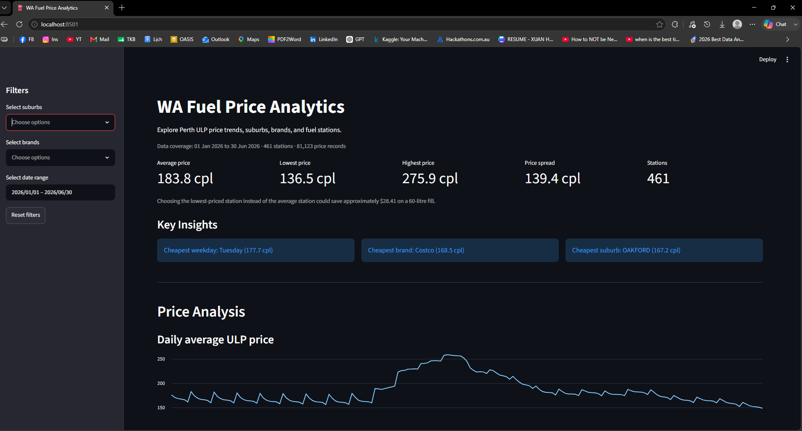
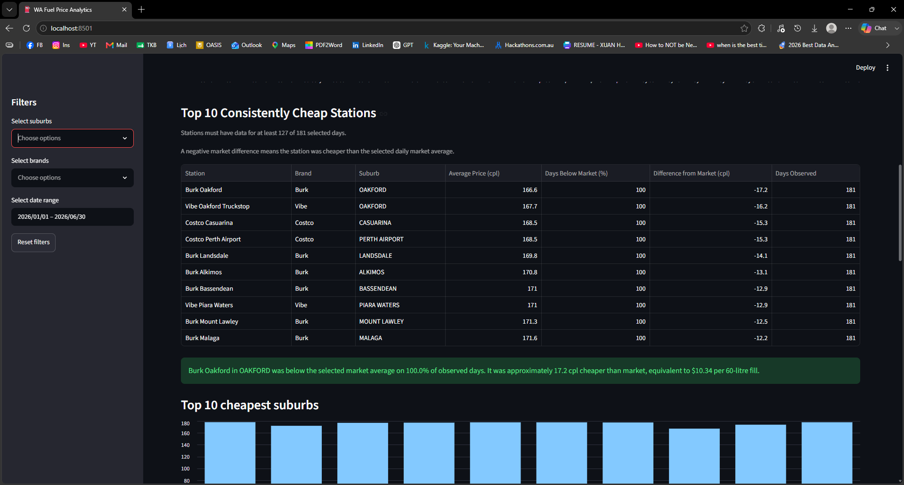

# Western Australia Fuel Price Analytics

An end-to-end data analytics project exploring regular unleaded petrol prices across the Perth metropolitan area.

The project uses Western Australian FuelWatch data from January to June 2026 to identify fuel-price trends, compare suburbs and brands, rank consistently competitive stations, and estimate potential savings for motorists.

## Market Context

The January–June 2026 period contained substantial fuel-price movements.

External factors such as international oil markets, supply conditions, government policy, exchange rates, and local retail competition may help explain some of these movements.

However, this project is descriptive. It identifies patterns in retail FuelWatch data and does not attempt to establish a causal relationship between external events and Perth fuel prices.

## Project Overview

Fuel prices can vary significantly depending on the day, suburb, brand, and individual station.

As a student who regularly drives to university and work, I wanted to better understand these variations and determine whether historical fuel-price data could help motorists make more informed refuelling decisions.

This project transforms raw FuelWatch records into a cleaned analytical dataset and an interactive Streamlit dashboard that helps answer practical questions such as:

* Which weekday had the lowest average ULP price?
* Which brands and suburbs recorded lower average prices?
* Which stations remained below the daily Perth market average?
* How much could a motorist potentially save on a full tank?
* How did Perth ULP prices change between January and June 2026?

## Project Objectives

* Clean and combine monthly FuelWatch datasets.
* Filter the data to regular unleaded petrol in the Perth metropolitan area.
* Analyse daily and weekly fuel-price patterns.
* Compare average prices across brands and suburbs.
* Identify stations that were consistently below the daily market average.
* Translate price differences into estimated savings for motorists.
* Develop an interactive dashboard for exploring the results.

## Data Source

The project uses retail fuel-price data published by:

**FuelWatch, Government of Western Australia**

FuelWatch website:

https://www.fuelwatch.wa.gov.au/

## Data Coverage

* January 2026 to June 2026
* Regular unleaded petrol (ULP)
* Perth metropolitan fuel stations
* Prices measured in cents per litre

The original raw CSV files are not included in the repository. They can be downloaded from the FuelWatch historical data service.

## Data Pipeline

The project follows this workflow:

```text
Raw monthly FuelWatch CSV files
              ↓
Data inspection and cleaning
              ↓
Perth Metro and ULP filtering
              ↓
Feature engineering
              ↓
Processed analytical dataset
              ↓
Exploratory data analysis
              ↓
Interactive Streamlit dashboard
```

## Data Preparation

The cleaning process includes:

* loading and combining monthly CSV files;
* standardising column names;
* parsing publication dates;
* converting prices to numeric values;
* removing incomplete or invalid records;
* filtering for regular unleaded petrol;
* filtering for Perth metropolitan stations;
* creating calendar features such as weekday and month;
* creating station identifiers;
* exporting a processed dataset for analysis and dashboard use.

## Exploratory Analysis

The exploratory analysis investigates:

* daily average, minimum, and maximum fuel prices;
* the cheapest and most expensive dates;
* average prices by weekday;
* average prices by fuel brand;
* average prices by suburb;
* stations that were frequently below the daily Perth average;
* estimated savings based on a 60-litre fuel tank.

## Key Findings

### Weekly Price Pattern

Tuesday had the lowest average ULP price during the study period, while Wednesday had the highest average price.

The average difference between the two days was approximately **15.29 cents per litre**, equivalent to around **$9.17 for a 60-litre tank**.

### Consistently Competitive Stations

Several eligible stations remained below the Perth daily ULP average on every observed day.

**Burk Oakford** was the strongest performer in the station analysis:

* approximately **17.23 cents per litre below** the daily Perth average;
* observed across **181 days**;
* equivalent to approximately **$10.34 per 60-litre fill**.

Burk, Vibe, Costco, and Liberty stations were strongly represented among the highest-ranked locations.

These findings describe patterns in the available dataset. They do not guarantee that the same stations or brands will always be cheapest in the future.

## Station Ranking Method

To make the station comparison more reliable:

1. Each station contributes one average price per day.
2. A daily Perth market average is calculated.
3. Each station's price is compared with that daily average.
4. The percentage of observed days below the market average is calculated.
5. A station must contain data for at least 70% of the selected days to be eligible.
6. Eligible stations are ranked by:

   * percentage of days below market;
   * average difference from market;
   * average price.

A negative difference from market means that the station was cheaper than the selected daily Perth average.

## Interactive Dashboard

The Streamlit dashboard provides:

* date-range filtering;
* suburb filtering;
* brand filtering;
* resettable filters;
* average, minimum, maximum, and price-spread KPIs;
* estimated savings against the average price;
* dynamic weekday, brand, and suburb insights;
* daily average ULP price trends;
* top consistently cheap stations;
* cheapest-suburb comparison;
* brand-price comparison;
* fuel-saving calculator;
* filtered record explorer;
* downloadable CSV results;
* explanatory notes about the analysis methodology.

## Dashboard Preview

### Dashboard Overview



### Consistently Cheap Station Ranking


```

## Project Structure

```text
wa-fuel-price-analytics/
│
├── dashboard/
│   └── app.py
│
├── data/
│   ├── raw/
│   └── processed/
│       └── perth_ulp_2026_01_to_06.csv
│
├── notebooks/
│   ├── 01_data_inspection.ipynb
│   └── 02_exploratory_analysis.ipynb
│
├── src/
├── sql/
├── docs/
├── .gitignore
├── README.md
└── requirements.txt
```

The `sql/` and `src/` directories are reserved for possible future extensions. SQL is not currently used in the completed analysis.

## Technologies

* Python
* pandas
* Matplotlib
* Streamlit
* Jupyter Notebook
* Git and GitHub

## Running the Project Locally

### 1. Clone the repository

```bash
git clone https://github.com/YOUR-USERNAME/wa-fuel-price-analytics.git
cd wa-fuel-price-analytics
```

Replace `YOUR-USERNAME` with the correct GitHub username.

### 2. Install the dependencies

```bash
pip install -r requirements.txt
```

### 3. Run the Streamlit dashboard

```bash
python -m streamlit run dashboard/app.py
```

The app should open automatically in a web browser.

## Limitations

* The analysis only covers January to June 2026.
* The dashboard focuses on regular unleaded petrol in metropolitan Perth.
* FuelWatch prices represent published retail prices rather than actual customer transactions.
* Brand and suburb averages may be affected by the number and location of available stations.
* Travel distance, fuel consumption, membership requirements, and convenience are not included in saving estimates.
* Historical results do not guarantee future fuel prices.
* External market and policy variables are not directly included in the dataset.

## Future Improvements

Possible extensions include:

* adding additional months of FuelWatch data;
* automating the monthly data pipeline;
* adding geographic station maps;
* calculating savings after estimated travel costs;
* integrating international oil-price data;
* comparing prices before and after major policy changes;
* storing the processed data in SQLite;
* adding SQL queries for suburb, brand, and station analysis;
* forecasting short-term fuel prices;
* deploying the dashboard publicly.

## Author

**Liam Doan**

Curtin University student based in Perth, Western Australia, studying Data Science and Information and Communication Technology.

## Acknowledgements

Fuel-price data is sourced from FuelWatch, Government of Western Australia.

This project was created for educational and portfolio purposes.

